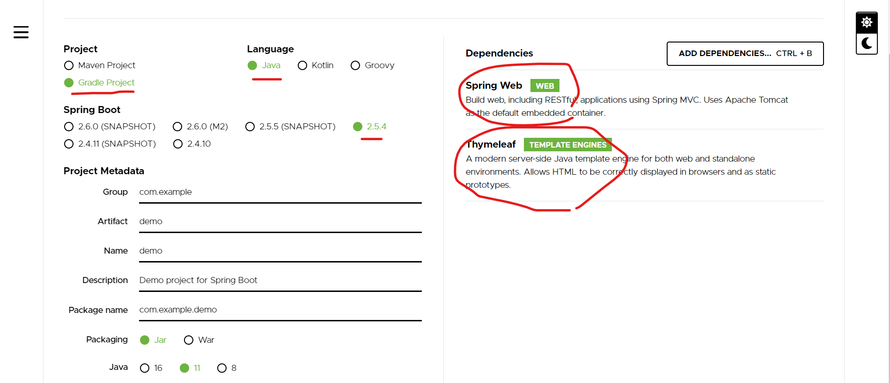
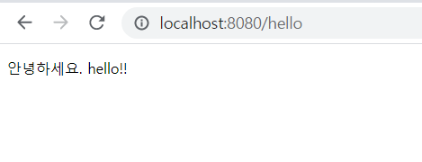
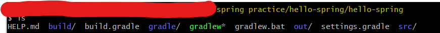
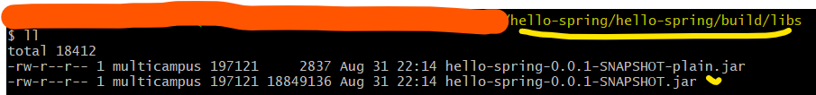
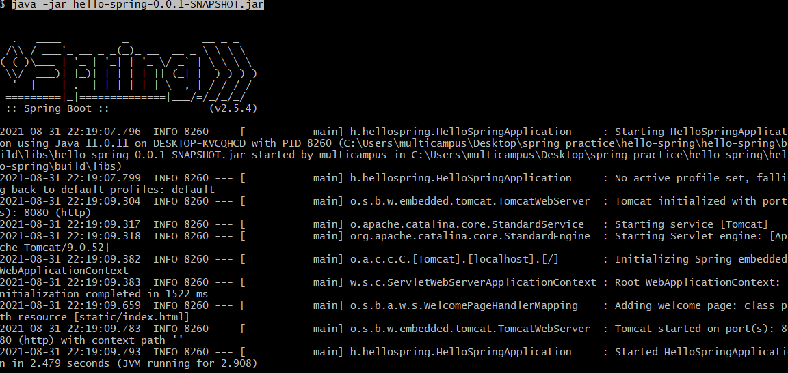
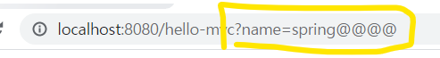
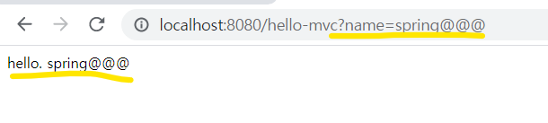
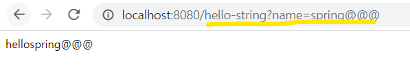
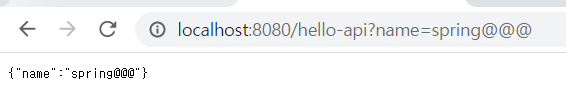

## 1. 프로젝트 환경설정

- [여기서 진행!](https://start.spring.io/)



## 오류없이 WelcomePage 만들어보기

- src/resources/static/**index.html**
  - index.html은 내가 만든 파일인데, 스프링에선 이걸 자동으로 welcomepage로 인식


## 그러면 동적 페이지는??


### hello페이지를 만들어 볼겁니다! 

- src/resources/static/**index.html**페이지의 작성 내용

```java
<!DOCTYPE HTML>
<html>
<head>
    <title>Hello</title>
    <meta http-equiv="Content-Type" content="text/html"; charset="UTF-8"
</head>
<body>
Hello
<a href="/hello">hello</a>
태그를 통해 /hello페이지로 가게끔
</body>
</html>
```

- src/main/java/hello.hellospring/controller/HelloController

```java
package hello.hellospring.controller;

import org.springframework.stereotype.Controller;
import org.springframework.ui.Model;
import org.springframework.web.bind.annotation.GetMapping;

@Controller
//Controller 어노테이션이 필수임
public class HelloController {

    @GetMapping("hello")
    // "/hello"라는 요청이 들어오면 여기서 매핑을 해주는 것
    public String hello(Model model) {
        model.addAttribute("data", "hello!!");
        // data는 AttribueName, hello!!는 AttributeValue
        return "hello";
        // return의 hello가 templates의 hello를 찾는다 (쟤한테가서 rendering하셈!)
    }
}
```

- src/main/resources/templates/hello.html

```java
<!DOCTYPE HTML>
<html xmlns:th="http://www.thymeleaf.org">
<head>
    <title>Hello</title>
    <meta http-equiv="Content-Type" content="text/html"; charset="UTF-8"
</head>
<body>
<p th:text="'안녕하세요. ' + ${data}">안녕하세요. 손님</p>
<!--th가 thymeleaf임-->
<!--controller에서 넘긴 이름이랑 다르면 null이 나온다(자바 기본값이 null이라서)-->
</body>
</html>
```


### 그럼 얘들이 어떻게 돌아가는데?

 *참고 : thymeleaf는 템플릿 엔진 동작 확인 역할

1. 웹브라우저에서(localhost:8080/hello) 요청을 보냄
2. 톰켓에서(내장된 웹서버) 받아서 /hello를 spring에서 찾아서 매칭(@GetMapping)
3. 그러면 HelloController에 있는 method가 실행된다
   1. HelloController안에 있는 `public String hello(Model model)`메소드가 실행
   2. model이 넘어오는데 이 model속에는 `key: data`, `value : hello!!`가 들어있음
      1. 컨트롤러에서 return값을 문자로 반환하면 viewResolver가 화면을 찾아서 처리
      2. viewResolver는templates의 viewName(지금은 hello)를 찾아가서 렌더링
4. 웹브라우저에 반영!



## 간단하게 build하고 실행하기

- 해당 프로젝트의 파일구조



- `./gradlew.bat build`(linux는 그냥 `./gradlew build`)

- 이후 `build/libs`경로로 들어감

- jar파일 확인

  

- `java -jar hello-spring-0.0.1-SNAPSHOT.jar`(java -jar 파일명)
- 스프링이 작동하는 것을 확인할 수 있다.




- 참고(뭔가 이상하다 싶을 때)

  - `./gradlew.bat clean build` build폴더 자체가 사라진다

  - 그리고 위의 과정을 다시 실행


# 2. 스프링 웹 개발 기초


## 정적 컨텐츠

- [공식문서 목차 7.1.5 Static Content](https://docs.spring.io/spring-boot/docs/current/reference/html/features.html#features)

1. 웹브라우저에서 `localhost:8080/hello-static.html` 요청을 보냄
2. 스프링에 내장된 톰켓서버에서 컨트롤러를 찾음 => Controller가 없넹?(우선순위가 여기 있음)
3. resources/static/hello-static.html찾아서 반환


### MVC와 템플릿 엔진

- model/controller는 내부적인 처리에 집중해야한다!
- view는 오직 보이는 페이지에만 집중한다!

- 전반적인 과정은 hello페이지를 만들때와 유사하다


1. HelloController에 작성

```java
    @GetMapping("hello-mvc")
    public String helloMvc(@RequestParam(value = "name") String name, Model model) {
    // required는 기본으로 true임, false를 넣으면 안보내도 되긴 함
    // 파라미터 부분에 ctrl + p 를 누르면 옵션을 볼 수 있음
    // 이번에는 외부에서 파라미터를 받아볼겁니다
        model.addAttribute("name", name);
        return "hello-template";
    }
```

2. return값과 똑같은 html파일을 templates안에 작성

```java
<html xmlns:th="http://www.thymeleaf.org">
<head>
    <title>Hello</title>
    <meta http-equiv="Content-Type" content="text/html"; charset="UTF-8"
</head>
<body>
<p th:text="'hello. ' + ${name}">hello! empty</p>
<!--hello! empty 부분은 서버없이 한번 보려고
thymeleaf에서는 html을 그대로 쓰고 파일을 서버없이 열어도 볼 수 있다-->
<!--동작을 하게되면 th:text 부분으로 치환이된다-->

</body>
</html>
```

3. `localhost:8080/hello-mvc`로(GetMapping을 통해 작성한 주소) 요청을 보내는데, 이때 parameter값을 넣어줘야 함



4. 내장된 톰켓서버에서 helloController를 찾아서 매칭

   1. 이때 `?name=spring@@@@`부분이 빠지면 parameter가 비게 되면(required=false로 한다면 작동은 하지만) 아래의 오류를 만나게 된다.

       `2021-09-01 14:16:53.163  WARN 14100 --- [nio-8080-exec-5] .w.s.m.s.DefaultHandlerExceptionResolver : Resolved [org.springframework.web.bind.MissingServletRequestParameterException: Required request parameter 'name' for method parameter type String is not present]`

5. parameter에 들어간 값이 페이지에 나오는 것을 볼 수 있음



### API

:star: 크게 두 가지 방식이 있음(다른 분류의 이야기라 이런식으로 나눈게 맞는진 모르겟지만...)

1. MVC : View브라우저 요청에 HTML응답을 반환
   - static contents 방식을 제외하면 잘 안쓰는 방식
2. API : 데이터를 반환(Front-end에서 처리하냐)


#### API가 작동하는 과정

1. localhost:8080/hello-api로 요청을 보냄

2. 내장된 톰켓 서버에서 `@ResponseBody`가 있다면 http 응답에 데이터를 그대로 넘겨줌

   - 데이터가 문자라면?

   ```java
   @GetMapping("hello-string")
   @ResponseBody
   // ResponseBody는 http에서 header와 body가 있는데 body에 이 데이터를 직접 넣어주겠다는 뜻
   public String helloString(@RequestParam("name") String name) {
       return "hello" + name;
   }
   ```

   

   - 데이터게 객체라면? => 이때 default가 Json방식으로 데이터를 만들어서 반환함

   ```java
       @GetMapping("hello-api")
       @ResponseBody
       public Hello helloApi(@RequestParam("name") String name) {
           Hello hello = new Hello();
           // ctrl + shift + enter하면 자동으로 줄 마무리 해줌
           hello.setName(name);
           return hello;
       }
   
       static class Hello {
           private String name;
           // getter setter란걸 썼는데 alt + insert
           // java bean 표준방식
           public String getName() {
               return name;
           }
   
           public void setName(String name) {
               this.name = name;
           }
       }
   ```

   


- 참고 : `@ResponseBody`를 사용
  - HTTP의 BODY에 문자 내용을 직접 반환
  - `viewResolver`대신에 `HttpMessageConverter`가 동작
    - 기본 문자처리 : `StringHttpMessageConverter`
    - 기본 객체처리 : `MappingJackson2HttpMessageConverter`
      - 객체를 Json으로 바꿔주는 라이브러리
    - 추가적으로 byte 처리 등등 기타 여러 `HttpMessageConverter`가 기본으로 등록되어 있음


